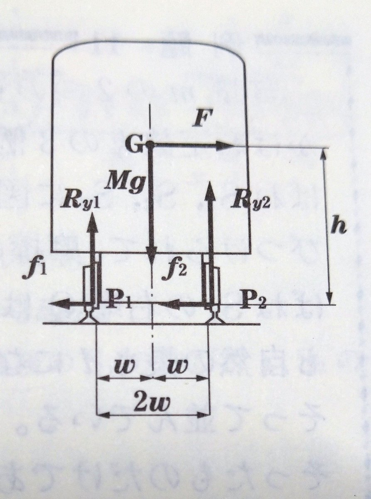
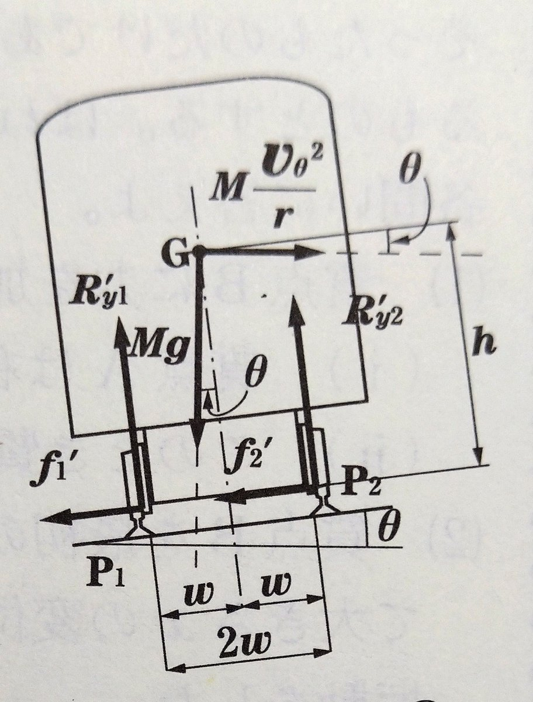

<!-- Global site tag (gtag.js) - Google Analytics -->

<!-- mathjax -->

# 例題10

例題10には二つの誤植があります. 

一つは, $\mathrm{P_{2}}$ まわりの力のモーメントを考えることになるので解答に影響はありませんが, 下図の $f_{1}$ の向きはこの逆向きであるべきです. 

そのため, [注] で述べられている向心力は $f_{2} - f_{1}$ であり, 水平方向の力の釣り合いは, 

$$
\begin{aligned}
  f_{2} - f_{1} = F = M\frac{v^2}{r} 
\end{aligned}
$$

となります.

二つ目は, (2) での議論が不十分であることです. この三重大の問題では, レール幅 $2w$ と, 重心と, レールと車輪の接触点からの高さ $h$ に関して明確な大小関係がないことで, この大小関係に気をつけて解答を記述する必要があります.

まず, 静止系において重心の並進運動の運動方程式は次のようになります.

$$
\begin{aligned}
  \text{半径方向} : &M\frac{v_{\theta}^2}{r} = (f_{2} - f_{2})\cos\theta + (R'_{y_{1}} + R'_{y_{2}})\sin\theta \cr
  \text{接戦方向} : &M\frac{dv_{\theta}}{dt} = 0\cr
  \text{鉛直方向} : &0 = -Mg -(f_{2} - f_{1})\sin\theta + (R'_{y_{1}} + R'_{y_{2}})\cos\theta
\end{aligned}
$$

$\mathrm{P_{1}}$, $\mathrm{P_{2}}$ をそれぞれ支点とした時の, 力のモーメントの釣り合いは, 

$$
\begin{aligned}
 \mathrm{P_{1}}\text{支点} :
  0 &= -w \times Mg\cos\theta + h \times Mg\cos\theta - h\times F\sin\theta - w \times F\sin\theta + 2w \times R'_{y_{2}}, \cr
 \mathrm{P_{2}}\text{支点} : 
  0 &= w \times Mg\cos\theta + h \times Mg\cos\theta - h\times F\sin\theta - w \times F\sin\theta - 2w \times R'_{y_{1}}.
\end{aligned}
$$

整理して, 

$$
\begin{aligned}
  R'_{y_{1}} = \frac{M\cos\theta}{2w}\left((w+h\tan\theta)g - \frac{v_{\theta}^2}{r}(h-w\tan\theta)\right), \cr

  R'_{y_{2}} = \frac{M\cos\theta}{2w}\left((w-h\tan\theta)g - \frac{v_{\theta}^2}{r}(h+w\tan\theta)\right).
\end{aligned}
$$

$v_{\theta} = 0$ の時点で列車は転覆してはならないので, このときの,$\mathrm{G}$ から鉛直した向きの直線と, $\mathrm{G}$ からレールへの垂線のなす角度を $\theta_{0}$ とすると, $\theta < \theta_{0}$ でなければなりません. よって, $\tan\theta_{0} = \frac{w}{h}$ より, $w - h\tan\theta > 0$ がわかります.

